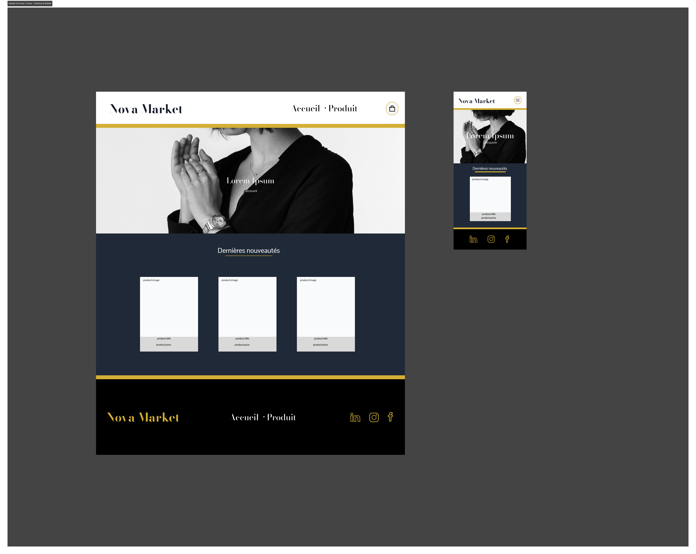
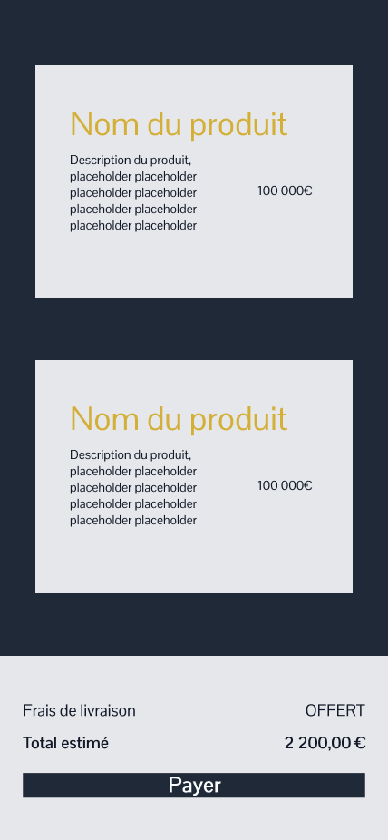
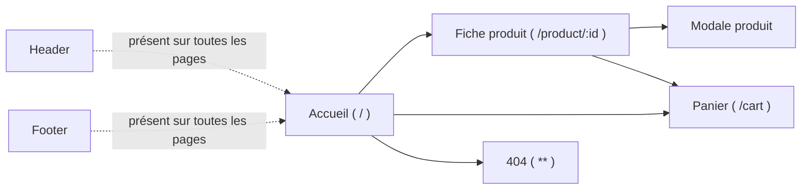

<h1 align="center">Développement d'un store</h1>

<p align="center">
  
  
  
</p>

<p align="center">
Boutique en ligne haut de gamme développée en **Angular**, **TypeScript** et **TailwindCSS**, dans le cadre du brief CDA *"Développement d'un store"* (groupe non assisté par l'IA)..
</p>

> Nous avons travaillé en équipe avec [**Chidori06**](https://github.com/Chidori06), [**MikaOcko**](https://github.com/MikaOcko), [**August2068**](https://github.com/August2068), [**porte-christophe**](https://github.com/porte-christophe) et [**fannysaez**](https://github.com/fannysaez)

Les produits sont récupérés dynamiquement depuis l'API publique [FakeStoreAPI](https://fakestoreapi.com/).

📖 Documentation complète (organisation, choix techniques, architecture, conventions Git...) : [Wiki du projet](https://github.com/developpement-sans-ia/developing-store/wiki)

---

### Structure du projet (`dev-sans-ia/`)

```text
dev-sans-ia/
├── public/                          # Assets statiques (favicon, etc.)
├── src/
│   ├── app/
│   │   ├── features/                # Pages / vues de l'application
│   │   │   ├── cart/                # Page panier
│   │   │   ├── home/                # Page d'accueil
│   │   │   ├── page404/             # Page 404
│   │   │   └── product/             # Page produit
│   │   │       └── modal/           # Modale produit
│   │   ├── shared/                  # Éléments réutilisables
│   │   │   ├── card-product/        # Composant carte produit
│   │   │   ├── card-product-detail/ # Composant détail produit
│   │   │   ├── footer/              # Composant footer
│   │   │   ├── header/              # Composant header
│   │   │   ├── services/
│   │   │   │   ├── cart-service/    # Service de gestion du panier
│   │   │   │   └── product-service/ # Service de récupération des produits (FakeStoreAPI)
│   │   │   └── types.ts             # Interfaces / types partagés
│   │   ├── app.ts                   # Composant racine
│   │   ├── app.routes.ts            # Configuration des routes
│   │   └── app.config.ts            # Configuration de l'application
│   ├── index.html
│   ├── main.ts                      # Point d'entrée (client)
│   ├── main.server.ts               # Point d'entrée (SSR)
│   └── styles.css                   # Styles globaux (Tailwind)
├── angular.json                     # Configuration Angular CLI
├── package.json
└── tsconfig*.json                   # Configurations TypeScript
```
---

## Technologies utilisées

- [Angular](https://angular.dev/) 22 (+ SSR)
- [TypeScript](https://www.typescriptlang.org/) 6
- [TailwindCSS](https://tailwindcss.com/) 4
- RxJS
- [Vitest](https://vitest.dev/) (tests unitaires)
- [FakeStoreAPI](https://fakestoreapi.com/) (données produits)

## Commandes essentielles

### Installation

```bash
# Installer Node.js (via nvm recommandé) puis vérifier
node -v
npm -v

# Installer le CLI Angular globalement
npm install -g @angular/cli

# Vérifier l'installation
ng version
```

### Créer un premier projet

```bash
git clone https://github.com/developpement-sans-ia/developing-store.git

cd developing-store/dev-sans-ia

npm install
```

Le CLI pose quelques questions à la création :

- `Would you like to add Angular routing?` → `y` pour activer le routage dès le départ
- `Which stylesheet format would you like to use?` → `CSS` (ou Sass/SCSS selon les besoins)

### Lancer le serveur de développement

```bash

ng serve
```

L'application est accessible sur `http://localhost:4200` et se recharge automatiquement à chaque modification (*hot reload*).

### Générer des éléments (schematics)

```bash
ng generate component nom-composant   # ou : ng g c nom-composant
ng generate service nom-service       # ou : ng g s nom-service
ng generate pipe nom-pipe             # ou : ng g p nom-pipe
ng generate directive nom-directive   # ou : ng g d nom-directive
ng generate interface nom-interface   # ou : ng g i nom-interface
```

### Build et tests

```bash
ng build     # Compile l'application pour la production (dossier dist/)
ng test      # Lance les tests unitaires (Karma/Jasmine)
ng lint      # Vérifie le style du code (si configuré)
```

---

## Captures d'écran de la maquette

<div align="center">
  
  
  <br>
  <sub><b>Desktop</b> · <b>Mobile</b></sub>
</div>

*(à ajouter au fil de l'avancement — voir aussi les maquettes détaillées sur le [Wiki](https://github.com/developpement-sans-ia/developing-store/wiki/Maquettes))*

---

## Organisation des pages

Schéma des pages prévues et de leur navigation (basé sur les vues du dossier `features/`) :



> ⚠️ Le routing (`app.routes.ts`) n'est pas encore câblé — ce schéma représente l'architecture cible d'après les vues déjà créées (`home`, `product`, `product/modal`, `cart`, `page404`). À mettre à jour dès que les routes sont définies.

## Gestion de projet

- **Suivi des tâches** : [Tableau Trello](https://trello.com/invite/b/6a60b501e450325fd477a727/ATTI20a4e6ffa4156e2869a3c676f38f564558780504/developpement-dun-store-sans-ia) — répartition des tâches entre les 5 membres de l'équipe, suivi de l'avancement par fonctionnalité.
- **Slides de présentation** : [Présentation du projet](https://docs.google.com/presentation/d/1kiOZJKM9v94lLBBvEVaEUfhDg47kZTVnbhCbRMHNskw/edit?usp=sharing) — organisation de l'équipe, maquettes, choix techniques, démo, retour d'expérience.
- Détails de l'organisation (répartition des tâches, méthode de travail, temps passés) : voir le [Wiki](https://github.com/developpement-sans-ia/developing-store/wiki).

---
## Restitution Nova Market - Groupe B

https://github.com/user-attachments/assets/3e12ae65-1921-4071-861d-33c0451efd4b

---

## Organisation du dépôt

- `dev-sans-ia/` — application Angular
- Branches : 
  - `main` (stable), 
  - `develop` (intégration),
  - `feat/*` (fonctionnalités) — détails sur le [Wiki](https://github.com/developpement-sans-ia/developing-store/wiki)


---

<p align="center">
  <a href="https://github.com/developpement-sans-ia/developing-store/wiki"></a>
</p>
